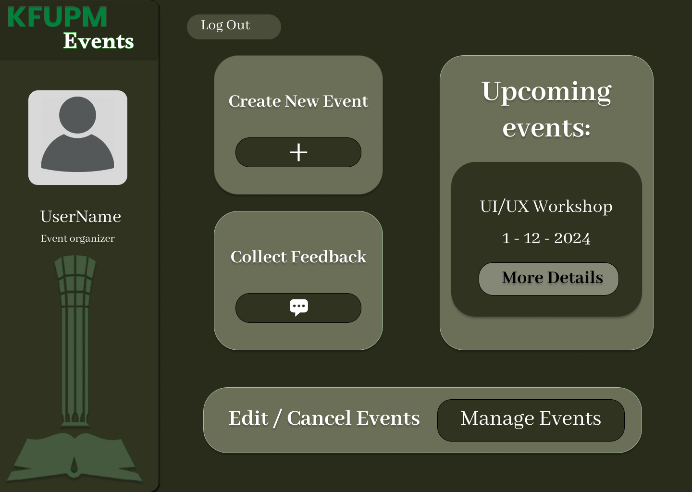
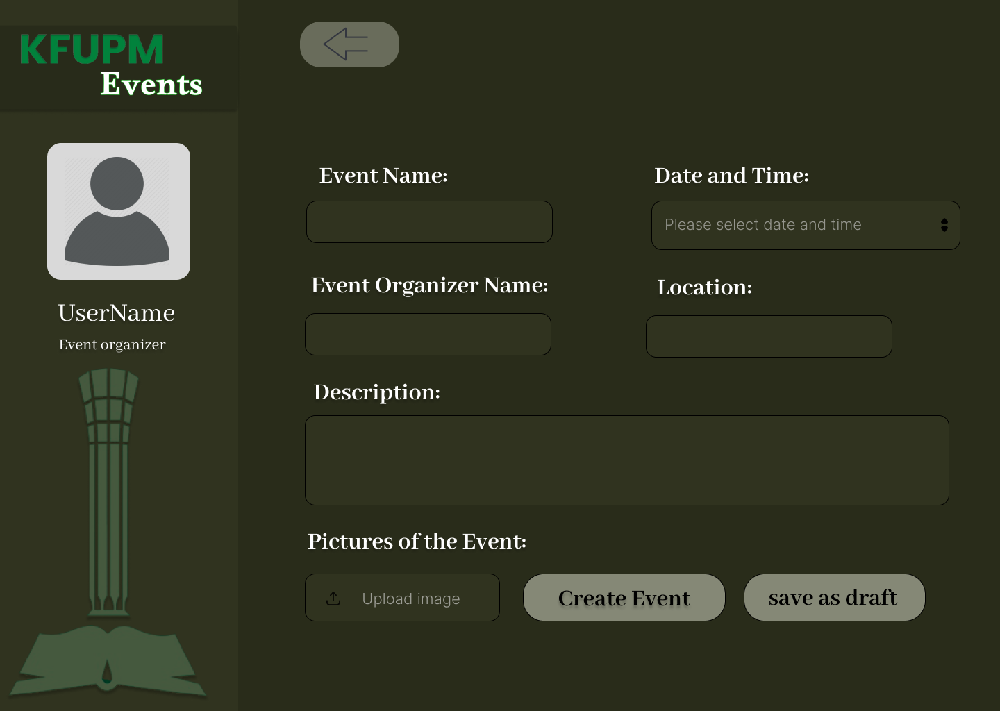
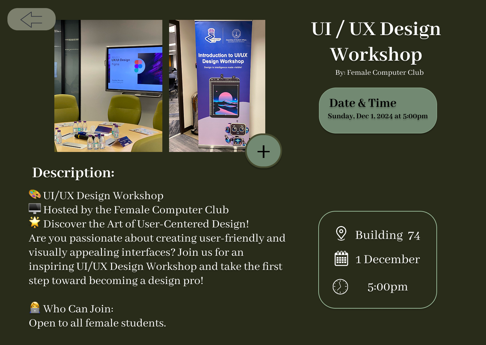

# KFUPM Events Platform – UI/UX Design

A UI/UX prototype for a university events management platform designed using **Figma**.  
The platform helps students discover campus events and allows organizers to create, manage, and promote events efficiently.

## Project Overview
This project was developed as part of the **SWE 206 course**.  
The goal was to design a system that improves the experience of discovering and managing university events at **King Fahd University of Petroleum & Minerals (KFUPM)**.

The platform allows:
- Students to explore upcoming events
- Organizers to create and manage events
- Users to view event details, time, and location

## My Contributions
- Participated in **requirements gathering and functional analysis**
- Contributed to the **system concept and interface design**
- Designed **UI/UX prototypes using Figma**
- Created key screens for event management and event discovery

## Figma Prototype
[View the Figma Design](https://www.figma.com/design/TUrfUsr1aA37ZPZv1lNYEg/KFUPM-Events?node-id=0-1&t=PHyn5g6mNXAOOYwh-1)

## Screenshots

### Organizer Dashboard

### Create Event

### Event Details

## Tools Used
- Figma
- UI/UX Design Principles
- Wireframing & Prototyping

## Course
SWE 206 – Software Engineering
